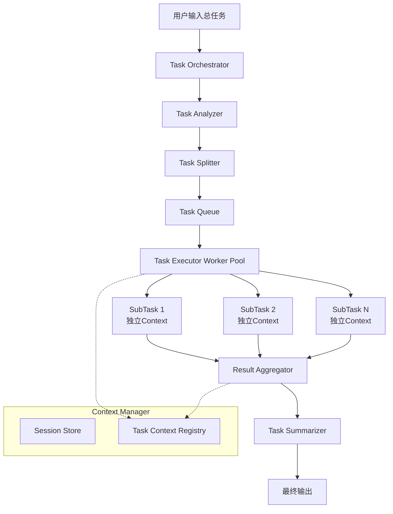

## 架构设计图

关键特性说明

### 1. **上下文隔离**

- 每个子任务有独立的`TaskContext`
- 通过`ContextManager`管理，使用`subTaskID`作为key
- 互不干扰，避免token累积

### 2. **Token控制**

- 实时监控每个上下文的token数
- 自动压缩机制：超过限制时总结旧对话
- 独立的token配额，不会跨任务累积

### 3. **并发执行**

- Worker Pool模式，支持配置并发数
- 无依赖的子任务并行执行
- 通过channel收集结果

### 4. **容错机制**

- 单个子任务失败不影响其他任务
- 失败信息记录到结果中
- 最终总结会包含失败信息

### 5. **可扩展性**

- 接口化设计，易于替换LLM提供商
- 支持自定义任务分析逻辑
- 可添加任务依赖关系管理

这个架构确保了每个子任务的对话历史独立，token数可控，并且整体执行流程清晰可追溯。你可以根据实际需求调整worker数量、token限制和压缩策略。
