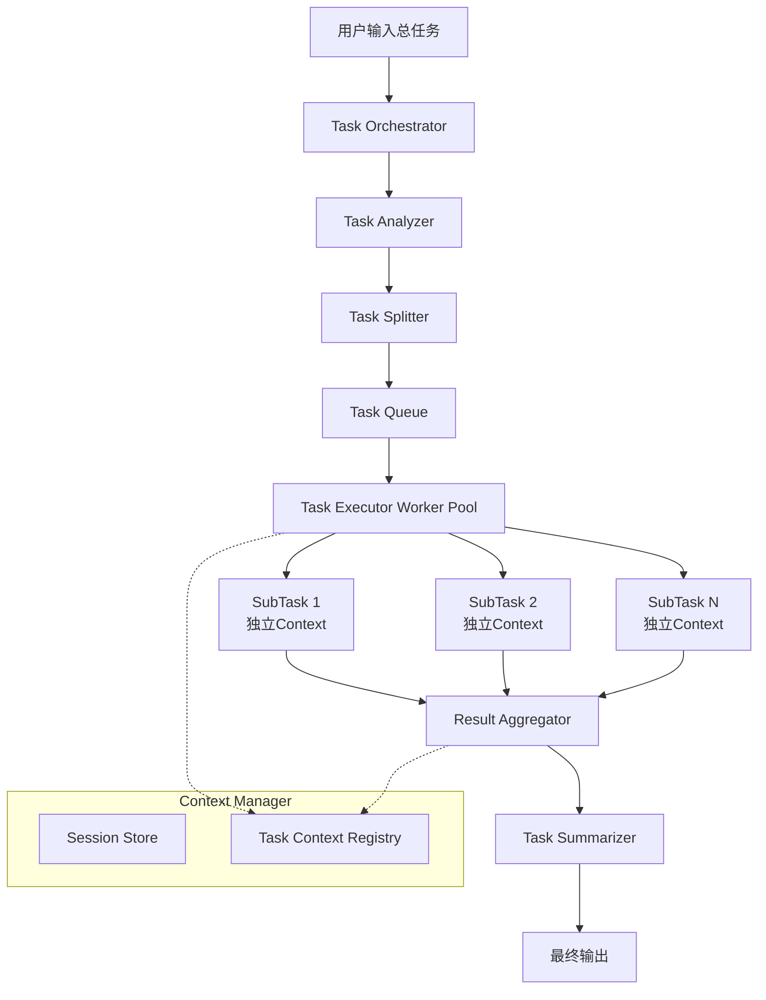

## 架构设计图



## 核心组件实现

### 1. 数据模型定义

```go
// models/task.go
package models

import (
    "time"
    "github.com/google/uuid"
)

// TaskStatus 任务状态
type TaskStatus string

const (
    StatusPending   TaskStatus = "pending"
    StatusRunning   TaskStatus = "running"
    StatusCompleted TaskStatus = "completed"
    StatusFailed    TaskStatus = "failed"
)

// Task 总任务
type Task struct {
    ID          string        `json:"id"`
    SessionID   string        `json:"session_id"`
    Description string        `json:"description"`
    Status      TaskStatus    `json:"status"`
    Subtasks    []*SubTask    `json:"subtasks"`
    Result      string        `json:"result"`
    CreatedAt   time.Time     `json:"created_at"`
    UpdatedAt   time.Time     `json:"updated_at"`
}

// SubTask 子任务
type SubTask struct {
    ID          string                 `json:"id"`
    TaskID      string                 `json:"task_id"`
    Description string                 `json:"description"`
    Status      TaskStatus             `json:"status"`
    Context     *TaskContext           `json:"context"`
    Input       map[string]interface{} `json:"input"`
    Output      string                 `json:"output"`
    Error       string                 `json:"error"`
    CreatedAt   time.Time              `json:"created_at"`
    UpdatedAt   time.Time              `json:"updated_at"`
}

// TaskContext 独立上下文
type TaskContext struct {
    SystemPrompt string                 `json:"system_prompt"`
    Messages     []Message              `json:"messages"`
    TokenCount   int                    `json:"token_count"`
    Metadata     map[string]interface{} `json:"metadata"`
}

// Message 对话消息
type Message struct {
    Role    string `json:"role"`    // system, user, assistant
    Content string `json:"content"`
}

// TaskResult 任务执行结果
type TaskResult struct {
    SubTaskID   string `json:"subtask_id"`
    Success     bool   `json:"success"`
    Output      string `json:"output"`
    TokenUsed   int    `json:"token_used"`
    ExecutionMs int64  `json:"execution_ms"`
    Error       string `json:"error"`
}
```

### 2. 上下文管理器

```go
// context/manager.go
package context

import (
    "fmt"
    "sync"
    "github.com/pkoukk/tiktoken-go"
    "your-project/models"
)

type ContextManager struct {
    mu          sync.RWMutex
    tokenizer   *tiktoken.Tiktoken
    maxTokens   int
    contexts    map[string]*models.TaskContext
}

func NewContextManager(maxTokens int) *ContextManager {
    // 使用 cl100k_base 编码器（适用于 GPT-4/GPT-3.5）
    tokenizer, _ := tiktoken.GetEncoding("cl100k_base")
  
    return &ContextManager{
        tokenizer: tokenizer,
        maxTokens: maxTokens,
        contexts:  make(map[string]*models.TaskContext),
    }
}

// CreateContext 为子任务创建独立上下文
func (cm *ContextManager) CreateContext(subTaskID string, systemPrompt string) *models.TaskContext {
    cm.mu.Lock()
    defer cm.mu.Unlock()
  
    ctx := &models.TaskContext{
        SystemPrompt: systemPrompt,
        Messages:     []models.Message{},
        TokenCount:   0,
        Metadata:     make(map[string]interface{}),
    }
  
    cm.contexts[subTaskID] = ctx
    return ctx
}

// GetContext 获取子任务的上下文
func (cm *ContextManager) GetContext(subTaskID string) (*models.TaskContext, error) {
    cm.mu.RLock()
    defer cm.mu.RUnlock()
  
    ctx, exists := cm.contexts[subTaskID]
    if !exists {
        return nil, fmt.Errorf("context not found for subtask: %s", subTaskID)
    }
    return ctx, nil
}

// AddMessage 添加消息到上下文，自动管理Token
func (cm *ContextManager) AddMessage(subTaskID string, role, content string) error {
    cm.mu.Lock()
    defer cm.mu.Unlock()
  
    ctx, exists := cm.contexts[subTaskID]
    if !exists {
        return fmt.Errorf("context not found")
    }
  
    msg := models.Message{
        Role:    role,
        Content: content,
    }
  
    // 计算新消息的Token数
    msgTokens := cm.countTokens(content)
  
    // 检查是否会超过限制
    if ctx.TokenCount+msgTokens > cm.maxTokens {
        // 触发压缩策略
        if err := cm.compressContext(ctx); err != nil {
            return err
        }
    }
  
    ctx.Messages = append(ctx.Messages, msg)
    ctx.TokenCount += msgTokens
  
    return nil
}

// compressContext 压缩上下文，保留关键信息
func (cm *ContextManager) compressContext(ctx *models.TaskContext) error {
    if len(ctx.Messages) <= 2 {
        return fmt.Errorf("cannot compress: too few messages")
    }
  
    // 策略：保留系统提示、最近5条消息，总结中间消息
    systemMsg := []models.Message{}
    if len(ctx.Messages) > 0 && ctx.Messages[0].Role == "system" {
        systemMsg = ctx.Messages[:1]
        ctx.Messages = ctx.Messages[1:]
    }
  
    // 保留最后5条消息
    keepCount := 5
    if len(ctx.Messages) <= keepCount {
        return nil
    }
  
    // 总结中间消息
    toSummarize := ctx.Messages[:len(ctx.Messages)-keepCount]
    summary := cm.summarizeMessages(toSummarize)
  
    // 构建新消息列表
    newMessages := make([]models.Message, 0)
    newMessages = append(newMessages, systemMsg...)
    newMessages = append(newMessages, models.Message{
        Role:    "system",
        Content: fmt.Sprintf("Previous conversation summary: %s", summary),
    })
    newMessages = append(newMessages, ctx.Messages[len(ctx.Messages)-keepCount:]...)
  
    // 重新计算Token
    ctx.Messages = newMessages
    ctx.TokenCount = cm.calculateTotalTokens(ctx.Messages)
  
    return nil
}

// summarizeMessages 总结消息（调用LLM进行压缩）
func (cm *ContextManager) summarizeMessages(messages []models.Message) string {
    // 这里应该调用LLM进行总结
    // 简化实现：拼接前100个字符
    summary := ""
    for _, msg := range messages {
        if len(msg.Content) > 100 {
            summary += msg.Content[:100] + "...\n"
        } else {
            summary += msg.Content + "\n"
        }
    }
    return summary
}

// countTokens 计算Token数
func (cm *ContextManager) countTokens(text string) int {
    tokens := cm.tokenizer.Encode(text, nil, nil)
    return len(tokens)
}

// calculateTotalTokens 计算总Token数
func (cm *ContextManager) calculateTotalTokens(messages []models.Message) int {
    total := 0
    for _, msg := range messages {
        total += cm.countTokens(msg.Content)
        // 每条消息的元数据开销
        total += 4
    }
    return total
}

// ClearContext 清除上下文（任务完成后）
func (cm *ContextManager) ClearContext(subTaskID string) {
    cm.mu.Lock()
    defer cm.mu.Unlock()
    delete(cm.contexts, subTaskID)
}
```

### 3. 任务分析器

```go
// analyzer/task_analyzer.go
package analyzer

import (
    "encoding/json"
    "fmt"
    "your-project/models"
)

type TaskAnalyzer struct {
    llmClient LLMClient
}

type LLMClient interface {
    Chat(messages []models.Message) (string, error)
}

func NewTaskAnalyzer(llmClient LLMClient) *TaskAnalyzer {
    return &TaskAnalyzer{
        llmClient: llmClient,
    }
}

// AnalyzeAndSplit 分析并拆分任务
func (ta *TaskAnalyzer) AnalyzeAndSplit(taskDescription string) ([]*models.SubTask, error) {
    // 第一步：分析任务
    analysisPrompt := fmt.Sprintf(`Analyze the following task and provide a breakdown:

Task: %s

Please output in JSON format:
{
    "task_type": "type of task",
    "complexity": "low/medium/high",
    "estimated_subtasks": number,
    "dependencies": ["list of dependency types"]
}

Analysis:`, taskDescription)
  
    analysis, err := ta.llmClient.Chat([]models.Message{
        {Role: "system", Content: "You are a task analysis expert."},
        {Role: "user", Content: analysisPrompt},
    })
    if err != nil {
        return nil, fmt.Errorf("failed to analyze task: %w", err)
    }
  
    // 第二步：拆分任务
    splitPrompt := fmt.Sprintf(`Based on the analysis, split the following task into smaller, independent subtasks:

Original Task: %s

Requirements for each subtask:
1. Each subtask must be independent and self-contained
2. Each subtask should have clear inputs and expected outputs
3. Subtasks should be executable in parallel when possible
4. Total subtasks should be between 2-8

Output as JSON array:
[
    {
        "id": "subtask_1",
        "description": "detailed description",
        "required_inputs": ["input1", "input2"],
        "expected_output": "description of output",
        "system_prompt": "custom system prompt for this subtask"
    }
]

Subtasks:`, taskDescription)
  
    response, err := ta.llmClient.Chat([]models.Message{
        {Role: "system", Content: "You are a task decomposition expert."},
        {Role: "user", Content: splitPrompt},
    })
    if err != nil {
        return nil, fmt.Errorf("failed to split task: %w", err)
    }
  
    var subtasksData []struct {
        ID             string   `json:"id"`
        Description    string   `json:"description"`
        RequiredInputs []string `json:"required_inputs"`
        ExpectedOutput string   `json:"expected_output"`
        SystemPrompt   string   `json:"system_prompt"`
    }
  
    if err := json.Unmarshal([]byte(response), &subtasksData); err != nil {
        return nil, fmt.Errorf("failed to parse subtasks: %w", err)
    }
  
    // 构建SubTask对象
    subtasks := make([]*models.SubTask, 0, len(subtasksData))
    for _, data := range subtasksData {
        subtask := &models.SubTask{
            ID:          data.ID,
            Description: data.Description,
            Status:      models.StatusPending,
            Context:     nil, // 稍后创建
            Input:       make(map[string]interface{}),
            Output:      "",
        }
      
        // 设置默认系统提示
        if data.SystemPrompt == "" {
            data.SystemPrompt = "You are a helpful assistant focused on completing this specific subtask."
        }
      
        subtasks = append(subtasks, subtask)
    }
  
    return subtasks, nil
}
```

### 4. 任务执行器

```go
// executor/task_executor.go
package executor

import (
    "context"
    "fmt"
    "sync"
    "time"
    "your-project/models"
    "your-project/context"
)

type TaskExecutor struct {
    llmClient      LLMClient
    contextManager *context.ContextManager
    workerCount    int
    resultChan     chan *models.TaskResult
}

type LLMClient interface {
    ChatWithContext(ctx context.Context, taskCtx *models.TaskContext, userMessage string) (string, int, error)
}

func NewTaskExecutor(llmClient LLMClient, cm *context.ContextManager, workerCount int) *TaskExecutor {
    return &TaskExecutor{
        llmClient:      llmClient,
        contextManager: cm,
        workerCount:    workerCount,
        resultChan:     make(chan *models.TaskResult, 100),
    }
}

// ExecuteSubtasks 并行执行子任务
func (te *TaskExecutor) ExecuteSubtasks(ctx context.Context, subtasks []*models.SubTask) []*models.TaskResult {
    var wg sync.WaitGroup
    results := make([]*models.TaskResult, 0, len(subtasks))
  
    // 创建工作池
    workQueue := make(chan *models.SubTask, len(subtasks))
    for i := 0; i < te.workerCount; i++ {
        wg.Add(1)
        go te.worker(ctx, &wg, workQueue)
    }
  
    // 发送任务
    for _, subtask := range subtasks {
        workQueue <- subtask
    }
    close(workQueue)
  
    // 等待完成
    go func() {
        wg.Wait()
        close(te.resultChan)
    }()
  
    // 收集结果
    for result := range te.resultChan {
        results = append(results, result)
    }
  
    return results
}

// worker 工作协程
func (te *TaskExecutor) worker(ctx context.Context, wg *sync.WaitGroup, workQueue <-chan *models.SubTask) {
    defer wg.Done()
  
    for subtask := range workQueue {
        result := te.executeSubTask(ctx, subtask)
        te.resultChan <- result
    }
}

// executeSubTask 执行单个子任务
func (te *TaskExecutor) executeSubTask(ctx context.Context, subtask *models.SubTask) *models.TaskResult {
    startTime := time.Now()
    result := &models.TaskResult{
        SubTaskID: subtask.ID,
        Success:   false,
    }
  
    // 更新状态
    subtask.Status = models.StatusRunning
  
    // 为子任务创建独立上下文
    systemPrompt := "You are an AI assistant. Complete the following subtask accurately and concisely."
    if subtask.Context != nil && subtask.Context.SystemPrompt != "" {
        systemPrompt = subtask.Context.SystemPrompt
    }
  
    taskContext := te.contextManager.CreateContext(subtask.ID, systemPrompt)
  
    // 添加系统提示
    te.contextManager.AddMessage(subtask.ID, "system", systemPrompt)
  
    // 构建执行提示
    executionPrompt := fmt.Sprintf("Execute the following subtask:\n\n%s\n\nProvide a clear and concise response.", subtask.Description)
  
    // 调用LLM
    output, tokenUsed, err := te.llmClient.ChatWithContext(ctx, taskContext, executionPrompt)
  
    result.ExecutionMs = time.Since(startTime).Milliseconds()
    result.TokenUsed = tokenUsed
  
    if err != nil {
        result.Error = err.Error()
        subtask.Status = models.StatusFailed
        subtask.Error = err.Error()
        return result
    }
  
    // 更新子任务
    subtask.Output = output
    subtask.Status = models.StatusCompleted
    result.Success = true
    result.Output = output
  
    // 任务完成后，可以选择清理上下文
    // te.contextManager.ClearContext(subtask.ID)
  
    return result
}
```

### 5. 总结器

```go
// summarizer/task_summarizer.go
package summarizer

import (
    "fmt"
    "strings"
    "your-project/models"
)

type TaskSummarizer struct {
    llmClient LLMClient
}

type LLMClient interface {
    Chat(messages []models.Message) (string, error)
}

func NewTaskSummarizer(llmClient LLMClient) *TaskSummarizer {
    return &TaskSummarizer{
        llmClient: llmClient,
    }
}

// Summarize 总结所有子任务结果
func (ts *TaskSummarizer) Summarize(originalTask string, subtasks []*models.SubTask, results []*models.TaskResult) (string, error) {
    // 构建任务执行摘要
    var summary strings.Builder
  
    summary.WriteString(fmt.Sprintf("Original Task: %s\n\n", originalTask))
    summary.WriteString("Subtask Results:\n")
  
    for i, subtask := range subtasks {
        result := results[i]
        status := "✅"
        if !result.Success {
            status = "❌"
        }
      
        summary.WriteString(fmt.Sprintf("%s Subtask %d: %s\n", status, i+1, subtask.Description))
        if result.Success {
            summary.WriteString(fmt.Sprintf("   Output: %s\n", truncate(subtask.Output, 200)))
        } else {
            summary.WriteString(fmt.Sprintf("   Error: %s\n", result.Error))
        }
        summary.WriteString(fmt.Sprintf("   Tokens: %d | Time: %dms\n", result.TokenUsed, result.ExecutionMs))
    }
  
    // 调用LLM生成最终总结
    finalPrompt := fmt.Sprintf(`Based on the following task and its execution results, provide a comprehensive summary:

%s

Please provide:
1. Overall completion status
2. Key findings and outputs
3. Any issues encountered
4. Final conclusion

Summary:`, summary.String())
  
    finalSummary, err := ts.llmClient.Chat([]models.Message{
        {Role: "system", Content: "You are a summary expert. Provide clear, concise summaries of task executions."},
        {Role: "user", Content: finalPrompt},
    })
  
    if err != nil {
        return summary.String(), err
    }
  
    return finalSummary, nil
}

func truncate(s string, maxLen int) string {
    if len(s) <= maxLen {
        return s
    }
    return s[:maxLen] + "..."
}
```

### 6. 编排器

```go
// orchestrator/task_orchestrator.go
package orchestrator

import (
    "context"
    "fmt"
    "sync"
    "your-project/models"
    "your-project/analyzer"
    "your-project/executor"
    "your-project/summarizer"
    "your-project/context"
)

type TaskOrchestrator struct {
    analyzer   *analyzer.TaskAnalyzer
    executor   *executor.TaskExecutor
    summarizer *summarizer.TaskSummarizer
    cm         *context.ContextManager
  
    activeTasks map[string]*models.Task
    mu          sync.RWMutex
}

func NewTaskOrchestrator(
    analyzer *analyzer.TaskAnalyzer,
    executor *executor.TaskExecutor,
    summarizer *summarizer.TaskSummarizer,
    cm *context.ContextManager,
) *TaskOrchestrator {
    return &TaskOrchestrator{
        analyzer:    analyzer,
        executor:    executor,
        summarizer:  summarizer,
        cm:          cm,
        activeTasks: make(map[string]*models.Task),
    }
}

// ProcessTask 处理总任务
func (to *TaskOrchestrator) ProcessTask(ctx context.Context, sessionID, taskDescription string) (*models.Task, error) {
    // 创建总任务
    task := &models.Task{
        ID:          generateID(),
        SessionID:   sessionID,
        Description: taskDescription,
        Status:      models.StatusPending,
        Subtasks:    []*models.SubTask{},
        CreatedAt:   time.Now(),
        UpdatedAt:   time.Now(),
    }
  
    to.mu.Lock()
    to.activeTasks[task.ID] = task
    to.mu.Unlock()
  
    defer func() {
        to.mu.Lock()
        delete(to.activeTasks, task.ID)
        to.mu.Unlock()
    }()
  
    // 步骤1: 分析并拆分任务
    task.Status = models.StatusRunning
    subtasks, err := to.analyzer.AnalyzeAndSplit(taskDescription)
    if err != nil {
        task.Status = models.StatusFailed
        return task, fmt.Errorf("failed to analyze task: %w", err)
    }
  
    task.Subtasks = subtasks
  
    // 步骤2: 执行子任务
    results := to.executor.ExecuteSubtasks(ctx, subtasks)
  
    // 步骤3: 总结任务
    summary, err := to.summarizer.Summarize(taskDescription, subtasks, results)
    if err != nil {
        task.Status = models.StatusFailed
        task.Result = "Failed to generate summary: " + err.Error()
        return task, err
    }
  
    task.Result = summary
    task.Status = models.StatusCompleted
    task.UpdatedAt = time.Now()
  
    return task, nil
}

// GetTaskStatus 获取任务状态
func (to *TaskOrchestrator) GetTaskStatus(taskID string) (*models.Task, error) {
    to.mu.RLock()
    defer to.mu.RUnlock()
  
    task, exists := to.activeTasks[taskID]
    if !exists {
        return nil, fmt.Errorf("task not found")
    }
  
    return task, nil
}

func generateID() string {
    return uuid.New().String()
}
```

### 7. LLM客户端实现

```go
// clients/openai_client.go
package clients

import (
    "context"
    "encoding/json"
    "fmt"
    "your-project/models"
    openai "github.com/sashabaranov/go-openai"
)

type OpenAIClient struct {
    client *openai.Client
    model  string
}

func NewOpenAIClient(apiKey, model string) *OpenAIClient {
    return &OpenAIClient{
        client: openai.NewClient(apiKey),
        model:  model,
    }
}

// Chat 普通对话
func (c *OpenAIClient) Chat(messages []models.Message) (string, error) {
    openaiMessages := make([]openai.ChatCompletionMessage, len(messages))
    for i, msg := range messages {
        openaiMessages[i] = openai.ChatCompletionMessage{
            Role:    msg.Role,
            Content: msg.Content,
        }
    }
  
    resp, err := c.client.CreateChatCompletion(
        context.Background(),
        openai.ChatCompletionRequest{
            Model:    c.model,
            Messages: openaiMessages,
        },
    )
  
    if err != nil {
        return "", err
    }
  
    return resp.Choices[0].Message.Content, nil
}

// ChatWithContext 带上下文的对话（自动管理Token）
func (c *OpenAIClient) ChatWithContext(ctx context.Context, taskCtx *models.TaskContext, userMessage string) (string, int, error) {
    // 构建消息列表
    messages := make([]openai.ChatCompletionMessage, 0, len(taskCtx.Messages)+1)
  
    for _, msg := range taskCtx.Messages {
        messages = append(messages, openai.ChatCompletionMessage{
            Role:    msg.Role,
            Content: msg.Content,
        })
    }
  
    // 添加当前用户消息
    messages = append(messages, openai.ChatCompletionMessage{
        Role:    "user",
        Content: userMessage,
    })
  
    resp, err := c.client.CreateChatCompletion(
        ctx,
        openai.ChatCompletionRequest{
            Model:    c.model,
            Messages: messages,
        },
    )
  
    if err != nil {
        return "", 0, err
    }
  
    // 计算使用的Token数
    tokenUsed := resp.Usage.TotalTokens
  
    // 将响应添加到上下文
    assistantMessage := resp.Choices[0].Message.Content
  
    return assistantMessage, tokenUsed, nil
}
```

### 8. 主程序示例

```go
// main.go
package main

import (
    "context"
    "fmt"
    "log"
    "os"
  
    "your-project/analyzer"
    "your-project/clients"
    "your-project/context"
    "your-project/executor"
    "your-project/orchestrator"
    "your-project/summarizer"
)

func main() {
    // 初始化组件
    apiKey := os.Getenv("OPENAI_API_KEY")
    llmClient := clients.NewOpenAIClient(apiKey, "gpt-4")
  
    // 上下文管理器，每个子任务最大4000 tokens
    contextManager := context.NewContextManager(4000)
  
    // 分析器
    taskAnalyzer := analyzer.NewTaskAnalyzer(llmClient)
  
    // 执行器（3个并发worker）
    taskExecutor := executor.NewTaskExecutor(llmClient, contextManager, 3)
  
    // 总结器
    taskSummarizer := summarizer.NewTaskSummarizer(llmClient)
  
    // 编排器
    orchestrator := orchestrator.NewTaskOrchestrator(
        taskAnalyzer,
        taskExecutor,
        taskSummarizer,
        contextManager,
    )
  
    // 处理任务
    taskDescription := "帮我分析2024年AI行业趋势，并生成一份详细的报告，包括关键技术、市场应用和未来预测"
  
    ctx := context.Background()
    task, err := orchestrator.ProcessTask(ctx, "session_123", taskDescription)
  
    if err != nil {
        log.Fatalf("Task failed: %v", err)
    }
  
    fmt.Printf("Task Status: %s\n", task.Status)
    fmt.Printf("Result:\n%s\n", task.Result)
}
```

## 关键特性说明

### 1. **上下文隔离**

- 每个子任务有独立的`TaskContext`
- 通过`ContextManager`管理，使用`subTaskID`作为key
- 互不干扰，避免token累积

### 2. **Token控制**

- 实时监控每个上下文的token数
- 自动压缩机制：超过限制时总结旧对话
- 独立的token配额，不会跨任务累积

### 3. **并发执行**

- Worker Pool模式，支持配置并发数
- 无依赖的子任务并行执行
- 通过channel收集结果

### 4. **容错机制**

- 单个子任务失败不影响其他任务
- 失败信息记录到结果中
- 最终总结会包含失败信息

### 5. **可扩展性**

- 接口化设计，易于替换LLM提供商
- 支持自定义任务分析逻辑
- 可添加任务依赖关系管理

这个架构确保了每个子任务的对话历史独立，token数可控，并且整体执行流程清晰可追溯。你可以根据实际需求调整worker数量、token限制和压缩策略。
